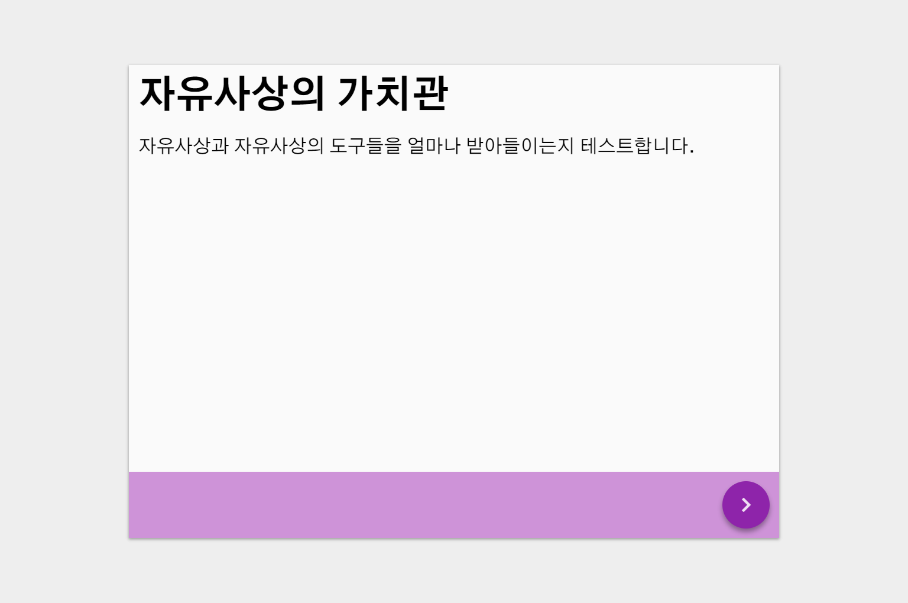
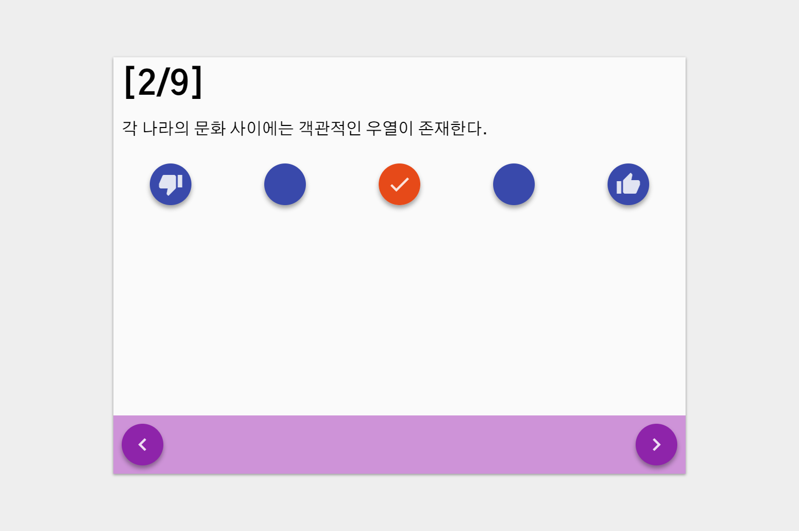
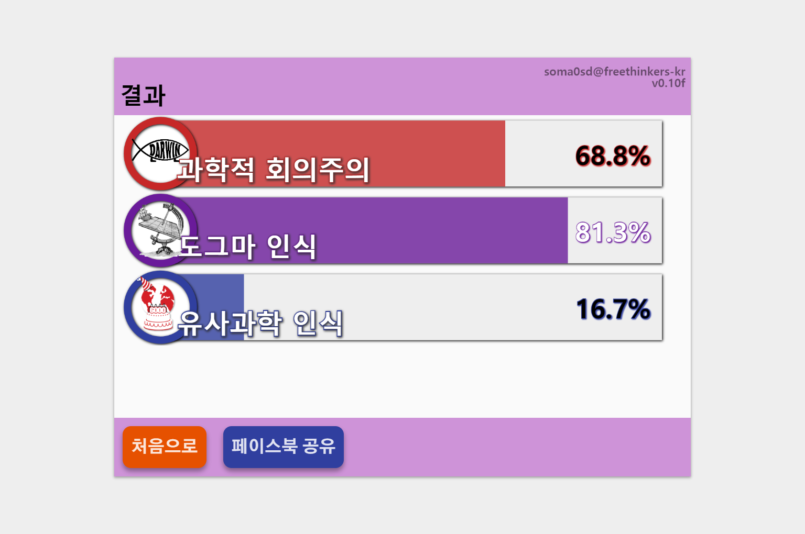

# Values-of-Freethought

# 가치관 및 질문 내용
`data.json`에는 크게 `"values"`와 `"contents"`의 두개 키가 있습니다.

* `"values"`: 가치관 변수에 대응하는 가치관의 보이는 이름입니다. 결과창에서 확인할 수 있습니다.
  * `"{가치관 변수명}": {String}`- 변수명에 이름을 할당합니다.
* `"contents"`: 질문의 내용과 가치관의 변동 포인트를 나타냅니다. 수치는 음수를 포함하는 정수 범위가 권장되며, 실수도 가능합니다. 상대적인 기여도로 작동합니다.
  * `"title": {String}`(생략 가능): 상단에 보일 이름입니다.
  * `"desc": {String}` (필수): 내용입니다. html태그를 사용할 수 있습니다.
  * `"score": {Object}`(생략 가능): 가치관 가중치를 담는 오브젝트입니다.
    * `"{가치관 변수명}": {Number}`(score가 있다면 필수): 가치관 가중치를 정합니다. 위의 `"values"`에 이름이 부여되지 않은 가치관 변수명을 사용하는 경우는 분석하지 않습니다.

**주의사항** 로컬에서 작업하는 경우, jQuery에서 json 파일을 가져오지 못합니다. 가상서버를 활용하여 json 파일이 url을 할당받으면 정상적으로 작동합니다.

# 질문 영역

`score`가 없는 `contents`항목은 위의 그림처럼 네비게이션 버튼과 제목, 내용이 나타납니다.

`score`가 있는 경우 동의하는 정도를 나타내는 라디오 박스가 생성되며 선택하지 않을 경우 다음으로 넘어가는 네비게이션 버튼이 비활성화 됩니다. 의견을 선택하면 다시 활성화됩니다.

# 결과 영역

`data.json`의 내용을 기반으로 한 분석결과를 보여줍니다. 각 항목을 나타내는 그림으로 `img/{가치관 변수명}.png`로 저장한 것들을 가져옵니다. 가급적 배경이 투명한 그림을 사용하시기 바랍니다.
